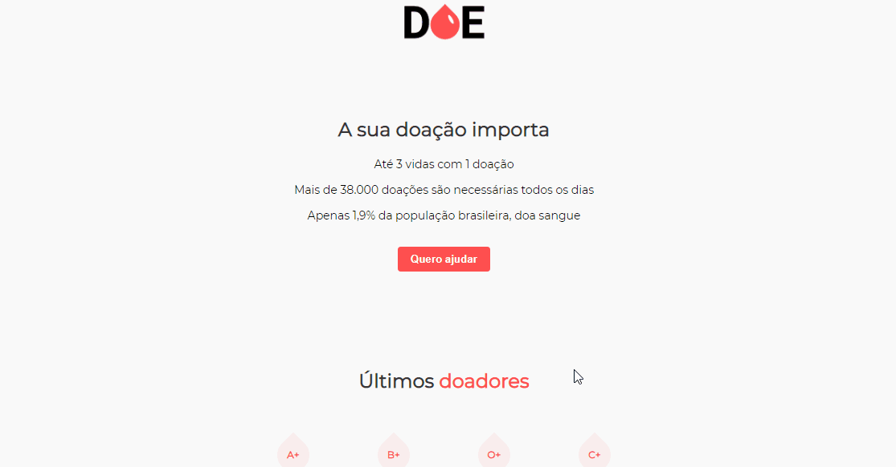

# *DOE SANGUE*
 

    

  

## 📕 About
The DOE SANGUE application was made during the Maratona Dev, commanded by the great @MaykBrito.

The application consists of a registration system for people who wish to donate blood in order to help people in need.
  

## 💻 Preview

    

  

## 🔨 Tools

- HTML
- CSS
- JavaScript
- Node
- PostgreSQL
  

## 🙋🏽‍♂️ Author

### Enzo Alexsander
